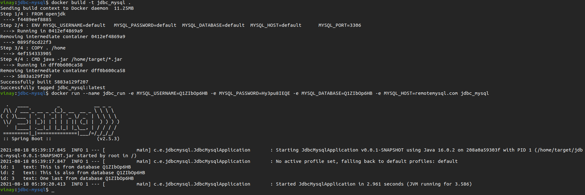
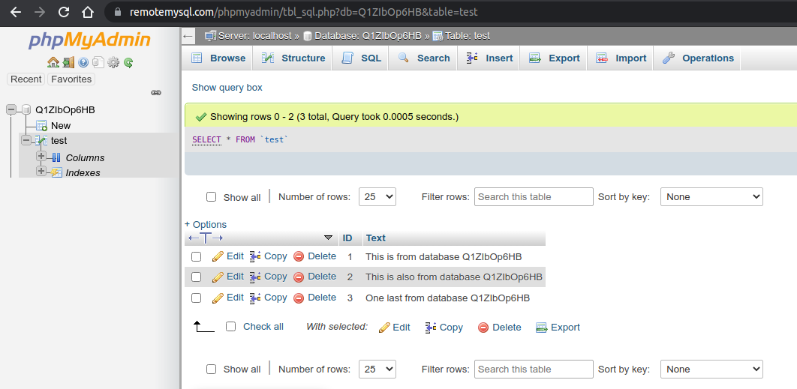

This application builds a simple docker image that connects to a mysql server using jdbc connector. The idea is to demonstrate a way to provide configuration variables as environment variables to the docker image.

In the code, 
- Dockerfile defines ENV variables required to setup MySQL connection. Values are set to string: "default" in Dockerfile, these will be altered to values we provide in the command when running the image. If we do not provide -e for any ENV variable, they take the value from Dockerfile (eg. MYSQL_PORT in this code)
- application.properties uses the container environment variables to make available to the springboot project
- JdbcConnection.java configuration class fetches the environment variables and makes the connection to remote mysql server. Prints output of select query from a table in db.

This code is pushed to dockerhub and is available at this [URL](https://hub.docker.com/repository/docker/vinaykumarbingi/jdbc-mysql).

1a) Pull the image from dockerhub to your local using following command:  

    docker pull vinaykumarbingi/jdbc-mysql

1b) You may also download this git repo and build locally for the docker image. You may do so by running this command in the git directory on the machine where it is downloaded. This command will create the image with name "jdbc-mysql".  

    docker build -t jdbc-mysql .

2a) Run the local image with environment variables using this command:  

    docker run --name jdbc_run -e MYSQL_USERNAME=Q1ZIbOp6HB -e MYSQL_PASSWORD=Hy3pu8IEQE -e MYSQL_DATABASE=Q1ZIbOp6HB -e MYSQL_HOST=remotemysql.com vinaykumarbingi/jdbc-mysql

2b) Or, if built locally with name "jdbc-mysql", use:

    docker run --name jdbc_run -e MYSQL_USERNAME=Q1ZIbOp6HB -e MYSQL_PASSWORD=Hy3pu8IEQE -e MYSQL_DATABASE=Q1ZIbOp6HB -e MYSQL_HOST=remotemysql.com jdbc-mysql

This will initiate the container with name jdbc_run. It takes the variables passed with the -e option and sets them as environment variables for the container system. The configuration class outputs the result from select query for the database table.

Image showing docker build and docker run for this project:

Select query on phpmyadmin console for mysql database:

